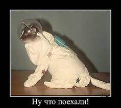

## 0. Постановка задачи

Попались мне лекции о компьютерном зрении в сельском хозяйстве, прекрасное чтиво должно быть. Но одна беда - лекции неудобочитаемы, так как размещены в виде отдельных изображений. Ну да и ладно, мы их скачаем и распознаем. Поехали!



### 0.1 Необходимые библиотеки

```bash
python -m venv venv
.\venv\Scripts\Activate.ps1
python.exe -m pip install --upgrade pip
```

## 1. Парсинг изображений

### 1.1 Подготовка окружения

```bash
pip install requests beautifulsoup4
```

### 1.2 🔍 Функционал скрипта `parse_and_download.py`

#### 📁 Входные данные:

Папка `links/` с текстовыми файлами, содержащими HTML-теги `` внутри которых есть ссылка на изображение

#### ⚙️ Процесс обработки:

 1. Создает папку `pics/` для сохранения изображений
 2. Парсит файлы в папке `links/` построчно, извлекая:
    - `name` - имя файла из атрибута тега
    - `src` - URL изображения из атрибута тега

 3. Скачивает изображения по найденным URL с повторами при ошибках;
 4. Автоматически определяет расширение файла (из URL или Content-Type);
 5. Проверяет существование файлов чтобы избежать дубликатов

#### 📊 Результат:

 - Скачанные изображения сохраняются в папку `pics/`
 - Выводится подробная статистика по процессу
 - Обрабатываются ошибки сети, кодировок, файловой системы

#### 🛡️ Особенности:

 - Поддержка кодировок UTF-8 и CP1251
 - 3 попытки скачивания при ошибках сети
 - Прогрессивная загрузка с отображением прогресса
 - Умное определение расширений файлов

## 2. Распознавание изображений

### 2.1 Необходимые библиотеки

```bash
pip install pytesseract pillow
```

Tesseract OCR для Windows: [https://github.com/UB-Mannheim/tesseract/wiki](https://github.com/UB-Mannheim/tesseract/wiki) 

### 2.2 🔍 Функционал скрипта `text_recognition.py`

 - **Находит все изображения** в папке `pics`;
 - **Обрабатывает каждое изображение** через `pytesseract`;
 - **Сохраняет** в `lectures.md` в формате:

```text
# имя_файла.jpg

распознанный текст...

---

# следующее_изображение.jpg

текст...
```

## 3. Итого

Получили файл `lectures.md` который надо править ручками, потому что качество изображений оставляет желать лучшего (видно какой-то студент наспех нарезал слайды с презентации). Но поскольку эти лекции мне всё равно читать - то можно совместить приятное с полезным.

Исправленный файл лекций будет выложен позднее...
